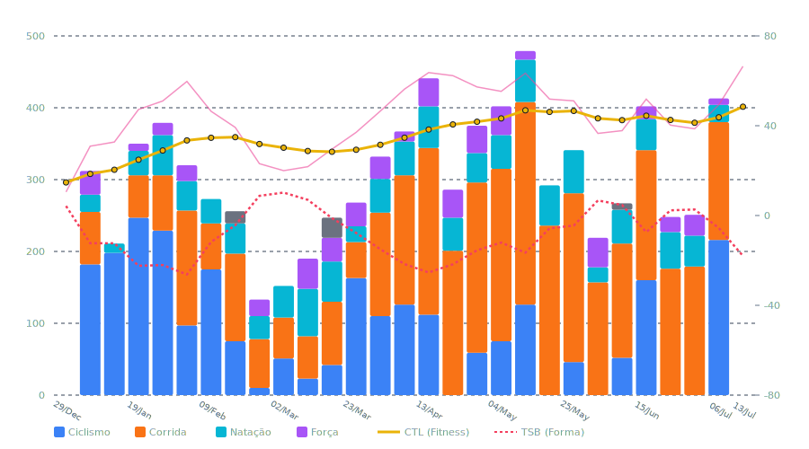

# 📊 Relatório de Carga de Treinamento 2026
*Gerado em 13/07/2026 às 17:16 com dados integrados do Intervals.icu.*

> [!NOTE]
> Este relatório apresenta a análise consolidada de treinos do ano de **2026**.
> Atualmente, o ano conta com **29 semanas** de dados processados.

## 📈 Visão Geral de Performance

| Métrica | Valor Consolidado | Observação / Média |
| :--- | :--- | :--- |
| **Carga Total (Load)** | **8206 TL** | Média de **283 TL** por semana |
| **Tempo Total** | **161.8 horas** | Média de **5.6h** por semana |
| **Atividades Realizadas** | **240 treinos** | Frequência de **8.3** por semana |
| **Pico de Carga Semanal** | **479 TL** | Aconteceu na semana de **11/05 a 17/05** |

## 📊 Distribuição de Carga por Modalidade
A tabela abaixo mostra a contribuição de cada esporte na carga de treinamento total e no tempo despendido.

| Modalidade | Carga Total (%) | Tempo Total (%) | Distância Total | Qtd. Treinos |
| :--- | :--- | :--- | :--- | :--- |
| 🏃 Corrida | **3880** (47.3%) | 60.9h (37.7%) | 438.0 km | 77 |
| 🚴 Ciclismo | **2574** (31.4%) | 50.8h (31.4%) | 935.7 km | 67 |
| 🏊 Natação | **1154** (14.1%) | 27.7h (17.1%) | 81.1 km | 50 |
| 💪 Força | **544** (6.6%) | 20.7h (12.8%) | - | 37 |
| ❓ Outros | **54** (0.7%) | 1.6h (1.0%) | 4.3 km | 9 |

## 📈 Gráfico de Evolução Semanal (Carga vs. Fitness)
O gráfico a seguir ilustra a distribuição semanal de carga (barras por modalidade) sobreposta com a curva de **Fitness (CTL)** e **Forma (TSB)**.

## 🗓️ Consolidação Mensal
Abaixo, o detalhamento do volume de treino agrupado mês a mês.

| Mês | Carga Total | Horas Totais | Corrida | Ciclismo | Natação | Média HRV | Média Sono |
| :--- | :--- | :--- | :--- | :--- | :--- | :--- | :--- |
| Dezembro 2025 | **0** | 0.0h | - | - | - | 51.2 ms | 7.0 h |
| Janeiro 2026 | **1252** | 23.7h | 23.9 km | 289.2 km | 9.2 km | 65.4 ms | 7.8 h |
| Fevereiro 2026 | **982** | 19.5h | 49.2 km | 136.2 km | 10.0 km | 71.6 ms | 8.4 h |
| Março 2026 | **1189** | 24.5h | 51.3 km | 115.9 km | 15.5 km | 92.0 ms | 8.4 h |
| Abril 2026 | **1469** | 29.4h | 91.2 km | 125.2 km | 14.2 km | 105.5 ms | 8.3 h |
| Maio 2026 | **1514** | 29.7h | 112.8 km | 98.0 km | 15.4 km | 103.6 ms | 8.4 h |
| Junho 2026 | **1387** | 26.4h | 91.4 km | 68.0 km | 15.1 km | 87.1 ms | 8.2 h |
| Julho 2026 | **413** | 8.5h | 18.2 km | 103.2 km | 1.6 km | 56.0 ms | 7.8 h |

## 📅 Progressão Semanal Detalhada
Linha do tempo completa do ano, com o balanço de carga por esporte e as métricas de saúde ao final de cada semana.

| Semana | Carga (TL) | Horas | Detalhamento Esportes | Balanço TSB Final | HRV Médio | Sono Médio |
| :--- | :--- | :--- | :--- | :--- | :--- | :--- |
| 13/07 - 19/07 | **0** | 0.0h | - | 🚀 -18.0 (Evolução) | 47.0 ms | 7.9h |
| 06/07 - 12/07 | **413** | 8.5h | 🏃 164, 🚴 216, 🏊 24, 💪 9 | 🟢 -5.6 (Manutenção) | 65.0 ms | 7.8h |
| 29/06 - 05/07 | **251** | 4.9h | 🏃 179, 🏊 43, 💪 29 | 🟢 2.7 (Manutenção) | 74.7 ms | 7.8h |
| 22/06 - 28/06 | **248** | 4.3h | 🏃 176, 🏊 51, 💪 21 | 🟢 2.3 (Manutenção) | 96.0 ms | 8.2h |
| 15/06 - 21/06 | **402** | 7.8h | 🏃 181, 🚴 160, 🏊 43, 💪 18 | 🟢 -7.4 (Manutenção) | 94.9 ms | 8.8h |
| 08/06 - 14/06 | **267** | 5.1h | 🏃 159, 🚴 52, 🏊 47 | 🟢 4.7 (Manutenção) | 83.3 ms | 8.2h |
| 01/06 - 07/06 | **219** | 4.3h | 🏃 157, 🏊 21, 💪 41 | 🔵 +6.7 (Descanso) | 86.7 ms | 8.0h |
| 25/05 - 31/05 | **341** | 6.9h | 🏃 235, 🚴 46, 🏊 60 | 🟢 -4.5 (Manutenção) | 103.9 ms | 8.1h |
| 18/05 - 24/05 | **292** | 5.2h | 🏃 236, 🏊 56 | 🟢 -5.7 (Manutenção) | 102.7 ms | 8.4h |
| 11/05 - 17/05 | **479** | 9.1h | 🏃 282, 🚴 126, 🏊 59, 💪 12 | 🚀 -16.5 (Evolução) | 110.4 ms | 8.1h |
| 04/05 - 10/05 | **402** | 8.5h | 🏃 240, 🚴 75, 🏊 47, 💪 40 | 🚀 -12.1 (Evolução) | 97.4 ms | 8.8h |
| 27/04 - 03/05 | **375** | 7.3h | 🏃 237, 🚴 59, 🏊 41, 💪 38 | 🚀 -15.5 (Evolução) | 104.1 ms | 8.3h |
| 20/04 - 26/04 | **286** | 5.7h | 🏃 201, 🏊 46, 💪 39 | 🚀 -21.7 (Evolução) | 106.7 ms | 8.2h |
| 13/04 - 19/04 | **441** | 9.4h | 🏃 232, 🚴 112, 🏊 58, 💪 39 | 🚀 -25.4 (Evolução) | 110.6 ms | 8.4h |
| 06/04 - 12/04 | **367** | 7.0h | 🏃 180, 🚴 126, 🏊 47, 💪 14 | 🚀 -21.6 (Evolução) | 100.4 ms | 8.4h |
| 30/03 - 05/04 | **332** | 6.5h | 🏃 144, 🚴 110, 🏊 47, 💪 31 | 🚀 -15.0 (Evolução) | 90.6 ms | 8.1h |
| 23/03 - 29/03 | **268** | 5.5h | 🏃 50, 🚴 163, 🏊 22, 💪 33 | 🟢 -7.8 (Manutenção) | 101.1 ms | 8.2h |
| 16/03 - 22/03 | **247** | 5.4h | 🏃 88, 🚴 42, 🏊 56, 💪 33 | 🟢 -1.2 (Manutenção) | 94.9 ms | 8.4h |
| 09/03 - 15/03 | **190** | 3.9h | 🏃 59, 🚴 23, 🏊 66, 💪 42 | 🔵 +7.0 (Descanso) | 100.6 ms | 8.8h |
| 02/03 - 08/03 | **152** | 3.1h | 🏃 57, 🚴 51, 🏊 44 | 🔵 +10.2 (Descanso) | 73.0 ms | 8.5h |
| 23/02 - 01/03 | **133** | 3.1h | 🏃 68, 🚴 10, 🏊 32, 💪 23 | 🔵 +8.8 (Descanso) | 78.0 ms | 8.1h |
| 16/02 - 22/02 | **256** | 5.3h | 🏃 122, 🚴 75, 🏊 42 | 🟢 -4.3 (Manutenção) | 75.1 ms | 8.4h |
| 09/02 - 15/02 | **273** | 5.1h | 🏃 64, 🚴 175, 🏊 34 | 🚀 -11.8 (Evolução) | 69.9 ms | 8.7h |
| 02/02 - 08/02 | **320** | 6.0h | 🏃 160, 🚴 97, 🏊 41, 💪 22 | 🚀 -26.3 (Evolução) | 63.4 ms | 8.3h |
| 26/01 - 01/02 | **379** | 7.7h | 🏃 77, 🚴 229, 🏊 56, 💪 17 | 🚀 -22.1 (Evolução) | 70.3 ms | 7.4h |
| 19/01 - 25/01 | **350** | 6.8h | 🏃 59, 🚴 247, 🏊 34, 💪 10 | 🚀 -22.4 (Evolução) | 66.4 ms | 7.2h |
| 12/01 - 18/01 | **211** | 3.5h | 🚴 198, 🏊 13 | 🚀 -12.4 (Evolução) | 69.1 ms | 8.7h |
| 05/01 - 11/01 | **312** | 5.6h | 🏃 73, 🚴 182, 🏊 24, 💪 33 | 🚀 -12.3 (Evolução) | 55.9 ms | 8.0h |
| 29/12 - 04/01 | **0** | 0.0h | - | 🟢 4.2 (Manutenção) | 51.2 ms | 7.0h |
